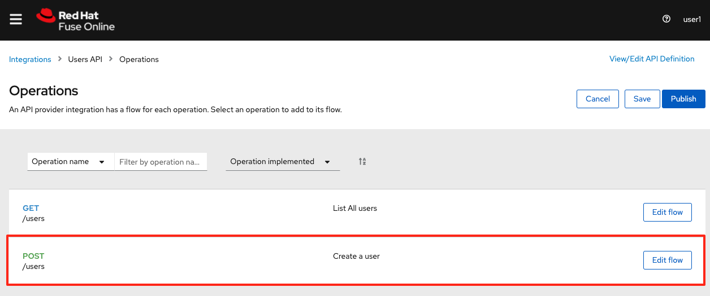
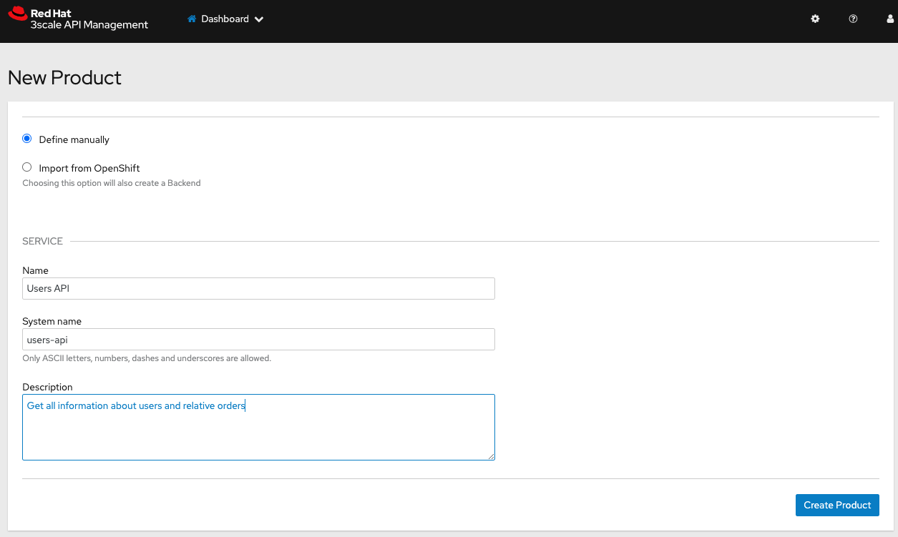
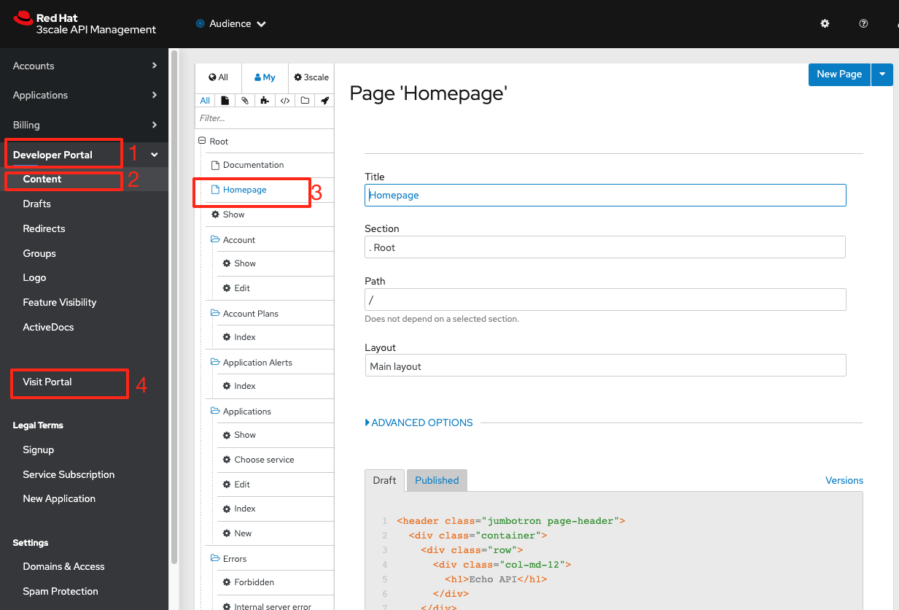
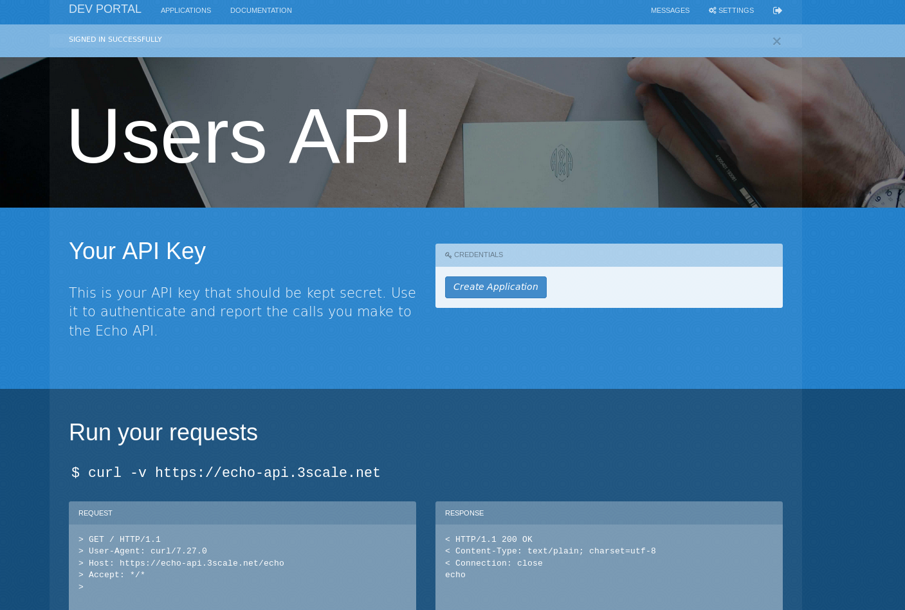

# Demo using Fuse Online and 3Scale 

Demo showing Fuse Online and 3Scale. This guide was based on Rodrigo Ramalho, it's new and  updated version.

We will create and expose an API that get data from a posgresql database using Fuse Online. After that, we'll expose it through 3Scale, you will set it up on the API Management platform to have control and visibility about this API.


## Pre-req

* Account on 3scale: https://www.3scale.net/
* Anyone environment RHPDS with OCP **OR** the **"easy"** form: this environment have the operators of Fuse online instantiated and ready to use yet >> RHPDS > "Workshops > DIL Streaming - Event-driven Workshop

## Links

* 3Scale Dashboard Samples: https://rramalho-admin.3scale.net
* Link fuse online available on OCP cluster
* OCP web link  are available via email when the environment are provisioned

## Easy/oficial environment: Workshops > DIL Streaming - Event-driven Workshop

* When instantiated will receive all credentials of environment 
* The projects are create automatically 
* This environment have the operator of Fuse in each project called "fuse-userX", just click route of "Syndesys...hproxy" and Fuse Online will open. (In this demo was used **"fuse-user1"**)

## Credentials

Use the following credentials to login into the web consoles:

* Your *username* is: `{user-username}`
* Your *password* is: `{user-password}`

For the 3Scale API Management you are going to use *redhat* as password.

[type=walkthroughResource]
.Fuse Online
****
* link:{fuse-user-url}[Fuse Online Console, window="_blank", , id="resources-fuse-user-url"]
****
[type=walkthroughResource]
.3Scale API Management
****
* link:{3scale-user-url}[3Scale API Management, window="_blank", , id="resources-3scale-user-url"]
****
[type=walkthroughResource]
.Red Hat OpenShift Developer Console
****
* link:{openshift-host}/topology/ns/{namespace}[Topology View, window="_blank"]
****

## 1. First of all: Creating database on Openshift

Login to Openshift using the credentials sent to you via e-mail, in this DEMO was used login **'admin'**. Now, let's create a new database in project `fuse-userX`: (If you prefer, can create via Openshift WEB)
```bash
# Create a new postgresql database using a Openshift template
oc new-app --template=postgresql-persistent --param=POSTGRESQL_PASSWORD=redhat --param=POSTGRESQL_USER=redhat --param=POSTGRESQL_DATABASE=sampledb -n fuse-userX
```
When the pod is ready, run:

```bash
# Get postgresql pod name
POD_POSTGRESQL=$(oc get po | grep postgresql | awk '{print $1}')

# Create database
oc exec -it $POD_POSTGRESQL -- bash -c 'psql -U redhat -d sampledb -c "CREATE TABLE users(id serial PRIMARY KEY,name VARCHAR (50),phone VARCHAR (50),age integer);"'

# Populate the database
oc exec -it $POD_POSTGRESQL -- bash -c "psql -U redhat -d sampledb -c \"INSERT INTO users(name, phone, age) VALUES  ('Jade', '(21) 12345678', 24);\""
oc exec -it $POD_POSTGRESQL -- bash -c "psql -U redhat -d sampledb -c \"INSERT INTO users(name, phone, age) VALUES  ('Francisco', '(11) 95474-8099', 40);\""
oc exec -it $POD_POSTGRESQL -- bash -c "psql -U redhat -d sampledb -c \"INSERT INTO users(name, phone, age) VALUES  ('Pedro', '(11) 23454367', 29);\""
oc exec -it $POD_POSTGRESQL -- bash -c "psql -U redhat -d sampledb -c \"INSERT INTO users(name, phone, age) VALUES  ('Rafael', '(21) 95474-8099', 55);\""
oc exec -it $POD_POSTGRESQL -- bash -c "psql -U redhat -d sampledb -c \"INSERT INTO users(name, phone, age) VALUES  ('Rodrigo', '(11) 95474-8099', 36);\""

# Make sure your data is saved
oc exec -it $POD_POSTGRESQL -- bash -c "psql -U redhat -d sampledb -c \"select * from users;\""
```

- If for some reason you need to reinstall the database, just run:

```bash
oc delete all -l app=postgresql-persistent -n fuse-demo
oc delete pvc postgresql -n fuse-demo
oc delete secret postgresql -n fuse-demo
```

## 2. Creating the Users API using the Low code Integration Solution Fuse Online
If you provisioned the **easy** environment have the operator of Fuse online in each project called "fuse-userX", just click route of "Syndesys...hproxy" and Fuse Online will open.


In order to create the Users API, first we need to manage to connect with the Users database.

=== 2.1 Creating the connection with the Users Database

. Open link:{fuse-user-url}[Fuse Online Console, window="_blank"] and log in with the credentials `{user-username}` `{user-password}` and accept the permission grant.
+
image::images/01.png[Fuse Online Access, role="integr8ly-img-responsive"]


. Now that you are on the iPaaS solution Red Hat Fuse, Click on `Connections`
+
image::images/02.png[Fuse Online Connections, role="integr8ly-img-responsive"]

. Click on `Create Connection`
+


. Filter for `database` and select the `Database` connection
+
image::images/04.png[Fuse Online Database Connection, role="integr8ly-img-responsive"]

. Fill the database configuration with the following values:

* `Connection URL`: `jdbc:postgresql://postgresql.fuse-{user-username}:5432/sampledb`
* `Username`: `redhat`
* `Password`: `redhat`

+
+


. Now, click on `Validate` to make sure everything is working as expected. If it is all good, click on `Next`.

. Fill `Users Database` for the *Connection Name*. Then, click on `Create`
+


. Now you should see connection `Users Database` listed in the connections page.
+
image::images/10.png[]

=== 2.2 Design and Create the Users API 

Now the we have the Users database already configured as a valid connection, we will create the connection to interact with this database and export it as a REST API.

. On the side menu `Integrations`, select `Create Integration`
+


. Select `API Provider` from the connections listed.
+
image::images/12.png[]

. Choose `Create a new OpenAPI 3x..., like below`
+
image::images/13.png[]

. Give it a name:
+


. Click on `Add a data type`
+
image::images/14.png[]

. Fill the *Name* field with the value `user` and paste the following JSON and choose `REST Resource`. Then, click `Save`. ** PLEASE DO NOT COPY USING THE PLUGIN **
+
[source,json,subs="attributes+"]
----
{
    "id": 0,
    "name": "Rodrigo Ramalho",
    "phone": "11 99555-2211",
    "age": 30
}
----
+
image::images/15.png[]

. Click `Save` again.

. Please take a look and see that all the CRUD REST operations (GET, POST, PUT, AND DELETE ) are already created for you with the attributes well defined and the data types inferred from the json model that we provided a model. We will implement *just two of them*. The *GET method retrieves all the users and the *POST to create a new user*. So, please remove the other methods.

. Select `/users/{userid}` and do a `Right Click` and select `Delete` option. 
+


. Your API Specification must look like that
+
image::images/16.png[]

. Click on `Next`
+
image::images/17.png[]

=== 2.3 Creating an API for `Get All Users` (GET)

In the previous step, we managed to create all the API Specification using a friendly UI based on the open-source project *Apicurio*. 
Now that we defined which are the contract of our API, let's start the development of each method, that in Fuse Online, we call it 
as a *Flow*. 

We will implement *just two of them*. The *GET method retrieves all the users and the *POST to create a new user*.

. Create a flow for the GET Method that list all users:
+


. Add a step in the flow clicking on `+`:
+


. Choose the `Users Database` connection created previously.
+
image::images/21.png[]

. Click on `Invoke SQL to obtain, store, update or delete data`:
+
image::images/22.png[]

. Fill the `SQL Statement` with: `select * from users` and then click `Next`
+


. Let's add a log step for debug purposes in our flow. Click again on the `+`:
+
image::images/24.png[]

. Then choose `Log`
+


. In the `Custom Text`, write `Loading users from database` and click `Done`.
+
image::images/26.png[]

. Can you see a warning showing that we have a mapping conflict? In order to solve it, let's add a `data mapping` to our Flow. 

. In the last step, click in the yellow icon and then go to `Add a data mapping step`.
+
image::images/27.png[]

. Expand both panel clicking on the arrows, drag and drop the source fields matching with the target fields and then click on `Done`.
+


. Click now on `Save`. Please pay attention not to publish! Otherwise, you will have to wait for the publishing process to finish.
+
image::images/30.png[]
+
image::images/30-1.png[]

=== 2.4 Creating API for Create a user (POST)

. From the combobox `Operations`, choose `Create a users`:
+


. Repeat the same steps you did on the previous step: `Creating an API for Get All Users (GET)`

. When adding the Users Database, you need to click on `Invoke SQL to obtain, store, update or delete data` and add `INSERT INTO USERS(NAME,PHONE,AGE) VALUES(:#NAME,:#PHONE,:#AGE);` in the field `SQL statement`.
+
image::images/32.png[]

. Also, during the data mapping you won't need to associate the `id` field because it will be already generate by the postgres database.
+
image::images/33.png[]

. In the end, you should have something like:
+
image::images/34.png[]

. Click on `Publish`
+
image::images/35.png[]

. Save and Publish!
+
image::images/35-1.png[]

We need to wait Openshift build and deploy our container. When done, you should see `Published version 1` on the top of the page.

. Go to the `Home` page, and look that is one integration running.
+
image::images/37.png[]

If you go to the Openshift webconsole in `Topology` you can see the pod **"i-users-api"** of integration available too:


=== 2.5 Testing your integration!

You can check if your integration is working properly running clicking on `View` Integration on Fuse Online and Copy and the External URL or clicking to access the route of integration(i-users-api) in Openshift webconsole:


. With the URL in hand, try to do a GET on the /users endpoint. Your URL will be like this below
+

link:https://i-users-api-fuse-userX.openshift-app-host/users[]

. To test the add user method (POST), try the following command in your terminal or the HTTP client of your preference:
+
[source,bash,subs="attributes+"]
----
  curl -X POST -H "Content-Type: application/json" https://i-users-api-fuse-userX.openshift-app-host/users -d '{"name": "myname", "age": 20, "phone": "61 3323-2314"}'
---- 

**DON'T FORGET TO MODIFY THE FIELDS "fuse-userX" AND "openshift-app-host" TO YOUR REALITY**


== 3.0 Exposing and management your API using 3Scale:
Access the console of 3scale with your credentials and let's put hands on. The next sections describes how Red Hat 3scale API Management works with APIs

To unsderstand the base, the 3scale separates your APIs into two main groups:

* **Backends:** Internal APIs bundled in a product. Backends grant API Providers the freedom to map their internal API organization structure to 3scale.

* **Products:** Customer-facing APIs. Products facilitate the creation of strong and simplified offerings for API consumers.
A product can contain multiple backends, and a backend can be used in multiple products. In other words, to **integrate and manage your API in 3scale you need to create both:**

A Backend containing at least the URL of your API. The backend can optionally have mapping rules, methods and metrics to facilitate reusability.
A Product where you define the application plans, and configure APIcast.


### 3.1 Creating the User API Backends


. Select `Create Backend` on the Tabs to create a new backend.
+
image::images/backend.png[]

. Fill the `Users API` backend creation form and click on `Create Backend`

* `Name`: `Users API`
* `System Name`: `users-api`
* `Description`: `Users API`
* `Private Base URL`: `https://i-users-api-fuse-userX.openshift-app-host`
+
image::images/create-backends/create-backends-03.png[]

. Check `User API` Backend Information and select `Methods`
+
image::images/create-backends/create-backends-04.png[]

. As we have two methods on the API we will define two methods. Methods helps to define specific rules for rate limit, monetization, enable and disable a specific endpoints and to have a more granular analytics metrics.
+


. Click on `New method` to create the `Get Users` method providing the following attributes and then click on `Create Method`.

* `Friendly Name`: `Get Users`
* `System Name`: `get-users`
* `Description`: `Get all users`

+
image::images/create-backends/create-backends-06.png[]

. Create the `Create Users` (POST)method providing the following attributes and then click on `Create Method`.

* `Friendly Name`: `Create Users`
* `System Name`: `create-users`
* `Description`: `Create an user`

+
image::images/create-backends/create-backends-07.png[]

. Now your `Methods & Metrics` page should be like that
+
image::images/create-backends/create-backends-08.png[]

. Let's create the `mapping rule`. `Mapping rules` is the http path that will be requested to access the endpoint.

. Create the `Get users` Mapping rule going to  `Mapping Rules` > `Add Mapping Rules`

* `Verb`: `GET`
* `Pattern`: `/users`
* `Metric or Method to increment`: `Get Users` (The method that we created previously)

+
image::images/create-backends/create-backends-09.png[]

. Create the `Create users` Mapping rule

* `Verb`: `POST`
* `Pattern`: `/users`
* `Metric or Method to increment`: `Create user` (The method that we created previously)

+


. The mapping rules overview should be like that
+
image::images/create-backends/create-backends-12.png[]

. And finnaly our backends should be like that at this moment
+


Now that we have the Backends we can work to create a `Product` representing multiples backends 
and finally expose this API on 3Scale API Management.


== 4.0 Creating the Users API Product

. Access the `PRODUCTS` tab and select `Create Product`
+
image::images/create-product/products.png[]

. Use the following attributes to fill the fields and click on `Create Product`

* `Name`: `Users API`
* `System name`: `users-api`
* `Description`: `Get all information about users and relative orders`

+


. This is the overview of your API Product right now
+


. Let's create two plans, one **sandbox** for enable users to try and another **production** that the user needs to pay for use it without any rate limit restriction. In `Create Application Plan`, create the `sandbox` application plan.

* `Name`: `sandbox`
* `System Name`: `sandbox`

+


. Create another plan named `production`

* `Name`: `production`
* `System Name`: `production`
* `Trial Period (days)`: `7`
* `Setup fee`: `1`
* `Cost per month`: `5`

+
image::images/create-product/create-product-06.png[]

. Now that you have both created, please `Publish` both clicking on `Publish`.
+ 
image::images/create-product/create-product-07.png[]

. Let's add the backends the we previously created
+ 


. Add `Users API` Backend

* `Backend Name`: `Users API`
* `Path`: `/users-api`

+
image::images/create-product/create-product-09.png[]


. Your backends properly configured should looks like this
+


. Delete the actual `GET /` Mapping Rule(created by default)
+
image::images/create-product/create-product-12.png[]

. Promote the API to `Staging. We can promote our URL to Staging that represents a Draft version of our API. And as soon as we are sure that this is the behavior expected we can promote to Production.


+


. Promote the API to `Production`
+
image::images/create-product/create-product-14.png[]

. As you can see the USER_KEY is invalid at this moment. It's because we don't have an Application using it yet, in order to solve it let's create one. On the `Up menu` select `Audience`.
+


. Select `Developer` from the account list
+ 


. Select `Application` on the horizontal menu
+ 


. Click on `Create Application`
+


. Select the `Production` plan under `Users API`
+


image::images/create-product/create-product-21.png[]
image::images/create-product/create-product-22.png[]


. Now that we have an application, the `USER_KEY` query parameter is filled with a valid key from the application that we just created. You can test using the URL available in `Example curl for testing`


image::images/create-product/create-product-23.png[]


== 5.0 Exposing User API through developer portal

. Select `Audience` on the upper drop down menu
+ 


. Select `Audience` on the upper drop down menu
+ 


. Select `Developer Portal` > `Content` > `Homepage`. Before to start editing, Click on `Visit Portal` to see the Out of the box Developer Portal provided. Notice that it is pre configured to use the `Echo API`, we will work to change it to work with the `Users API` that we just configured.
+ 


. Change the line 5 of the Homepage to `Users API` instead of `Echo API`
+ 
image::images/developer-portal/developer-portal-04.png[]

. Change the line `124` to `users-api` instead of `api`
+ 


. Before go ahead let's toggle some features of the portal, for this select the `Feature Visibility` from the side menu, and select to `Show` all of them 
+ 
image::images/developer-portal/developer-portal-06-1.png[]


. Take a look on the changes, it's already working with the Users API, and showing the applications plans defined previously.
+ 


. But the application plans is not properly defined, to best reflect real situations we need to do some adjusts on both of them. Navigate to the `Application Plans` option, using `Product: Users API` > `Applications` > `Application Plans` > `Sandbox`.
+
image::images/developer-portal/developer-portal-08.png[]

. Select `Limits` option under `Product Level` and click on `New usage limit`
+ 
image::images/developer-portal/developer-portal-09.png[]

. Define a limit of 5 requests per minute
+
image::images/developer-portal/developer-portal-10.png[]

. Your application plans should looks like it, remember to publish both
+


. For the `Production Plan`, create a new `pricing rule` on the `Product Level` since it doesn't have any limit, it's fair to be paid.
 

. Define a rule that charge `1$` for `10 API calls`. Yes, it's expensive, our service is first class and the content is super valuable.
image::images/developer-portal/developer-portal-14.png[]

. To make a test using Developer Portal and a created Plan(sandbox/production), let's create an user manually that will subscribe your application in API plan created by us. Go to menu `Audience > Create`, fill as you prefer the fields.
+


. After created,click on user account name, click on `services subscriptions` and let's add our API
+ 


. and let's add our API, making this available to use by user selected(in case of this demo "user1teste")


. Return to the `Developer Portal` and do the **sign in** providing the credentials that you created **(!USE FIREFOX TO TEST THIS!)**
+
image::images/developer-portal/devportal4.png[]

. Now that you are authenticated, click on `See your Applications & Credentials`
+
image::images/developer-portal/developer-portal-21.png[]

. Click on `Create application`
+


. Let's subscribe the app to API. Select the service `Users API`
+


. Fill the form with `user1teste`**(USE THE ACCOUNT CREATED BY YOU)** for Name and anyone description for the description field
+


. The applicaiton is properly registered and you can use the `User keys` to call the `Users API`.
+
image::images/developer-portal/developer-portal-26.png[]

. Make some requests, and after going to see the `Statistics` into the developer portal, it allows the user to have total control over how it is using each API. Go to menu `Products` > Select `Users API` > `Integration` > `Configuration` and copy the URL `Example curl for testing` to test the key generated in Developer Portal


== 6.0 User APIs Analytics

. After making some requests into the `User APIs` you can see how the analytics works. Hits represent all the requests, and also you can see the requests for each method.
+


. Click on the `Top application` in the left menu and see which is the applications that are consuming the `Users API`. This metric is strategic to understand how the customers is using your APIs and try to adjust plans to better fit them.
+


. It's also possible to see the metrics into the perspective of the `Backend`.
+
image::images/analytics/analytics-03.png[]
